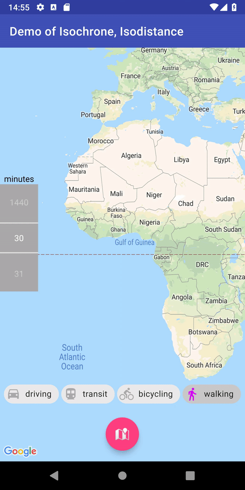

Isochrone and Isodistance(Kotlin, Android)
====

> Isochrone is a polygon representing how far you would go from a single point in every direction, following each road in a given timeframe. It's the best way to find out where you should live if you want to be «at most 5 minutes away from a tube station». Isodistance is similar, but ignores duration taken for traveling. For example by car you would go faster on highways, but with isodistance highways and sidewalks are the same.

# Glossary

isochrone = same duration from one start point

isodistance = same distance from one start point

# Status of project

👷 Run `./gradlew check`  or  `./gradlew check connectedCheck` to validate whole project including app and library firstly.

👍 *isochrone*, is already done, it can be used directly.

``` kotlin
getIsochrone(
             /*API-KEY for matrix and geocode APIs*/, 
             "walking", // Travel mode 
             "Address or lat-lng", //Target location, for "current location" is a good use-case. 
             120).consumeEach { // 120 minutes to target.
                        Log.d("algorithm", "rad1: ${it.pretty()}")
                        // You can draw all points based on an Array<LatLng> .
                    }
```

More info: FindLocationPresenter.kt



👷🔧 🚧 isodistance, coming soon and still in planning. 

# Setup

In order to use isochrone & isodistance the [Google's Distance Matrix API](https://developers.google.com/maps/documentation/distance-matrix/start) must be turned on. If the result locations must be sorted according to their bearings the [Google's Geocode API](https://developers.google.com/maps/documentation/geocoding/start) should also be used, please use same API-Key for both APIs.

### 🛑 Don't forget in project

- This repo doesn't contain: google_maps_key(string res)

- The gcp-key for matrix and geocode APIs: gcp_key(string res)


# Coroutines

Don't forget in client application:

```
kotlin {
    experimental {
        coroutines "enable"
    }
}
```

# Code robust & healthy with klint support
 
The project uses [ktlint](https://ktlint.github.io/) to enforce Kotlin coding styles.
Here's how to configure it for use with Android Studio (instructions adapted
from the ktlint [README](https://github.com/shyiko/ktlint/blob/master/README.md)):

- Close Android Studio if it's open

- Download ktlint:

  `curl -sSLO https://github.com/shyiko/ktlint/releases/download/0.24.0/ktlint && chmod a+x ktlint`

- Inside the project root directory run:

  `ktlint --apply-to-idea-project --android`

- Remove ktlint if desired:

  `rm ktlint`

- Start Android Studio

# Reference & Learn

https://isochrone.dugwood.com/index.html 

https://github.com/dugwood/isochrone-isodistance-with-google-maps

http://drewfustin.com/isochrones/

https://github.com/drewfustin/isocronut


# License

```
Copyright 2018 Chris Xinyue Zhao

Licensed to the Apache Software Foundation (ASF) under one or more contributor
license agreements. See the NOTICE file distributed with this work for
additional information regarding copyright ownership. The ASF licenses this
file to you under the Apache License, Version 2.0 (the "License"); you may not
use this file except in compliance with the License. You may obtain a copy of
the License at

http://www.apache.org/licenses/LICENSE-2.0

Unless required by applicable law or agreed to in writing, software
distributed under the License is distributed on an "AS IS" BASIS, WITHOUT
WARRANTIES OR CONDITIONS OF ANY KIND, either express or implied. See the
License for the specific language governing permissions and limitations under
the License.
```
